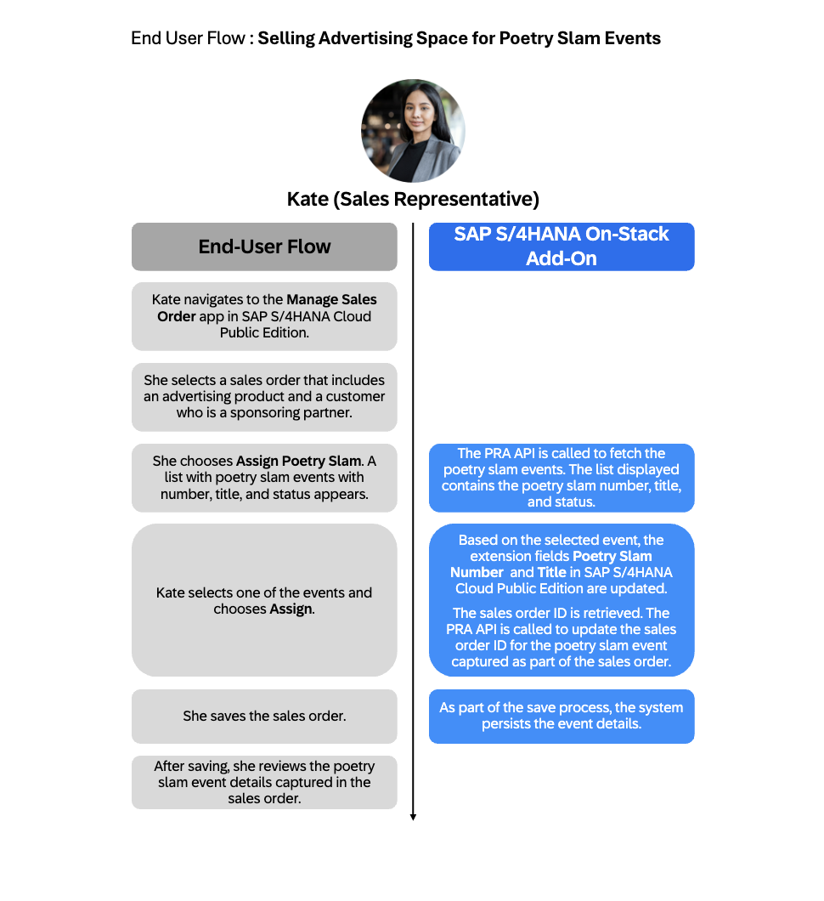
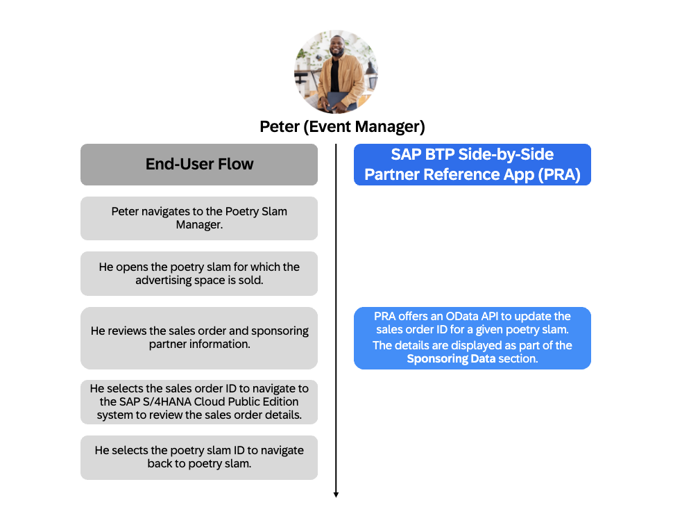

# Cross-Stack Partner Reference Extension  *Poetry Slam Event Commerce*

## Description

This showcases a cross-stack extension by demonstrating how an on-stack extension(PRA) on SAP S/4HANA Cloud Public Edition can seamlessly integrate with a side-by-side SAP BTP-based CAP multi-tenant application: **Poetry Slam Manager** (PRA).

The solution highlights:

- Developing extensions from the ground up, as well as enabling quick setup
- Seamless communication between on-stack and side-by-side components
- Real-time integration with SAP S/4HANA Cloud Public Edition entities such as sales orders and business partners

This repository provides a ready-to-consume multi-tenant application, **Poetry Slam Manager**, and a sample on-stack extension for **SAP S/4HANA Cloud Public Edition**.
It includes tutorials to help you build and integrate both components, enabling you to learn and deliver enterprise-grade, cross-stack extensions using ABAP Cloud and CAP.

## About the Sample Application – Poetry Slam Event Commerce

Imagine you're Peter, an event manager responsible for organizing poetry slam events. You need a clear overview of which partners are sponsoring each poetry slam event. Using the **Poetry Slam Manager** app, he can easily access sales orders and the associated sponsoring partners.

Kate, a sales representative, supports his tasks by creating sales orders in SAP S/4HANA Cloud Public Edition, selecting advertising products, and assigning sponsoring partners. She links these directly to the events in the **Poetry Slam Manager** app, enabling seamless collaboration between poetry slam event planning and sales.
The image below visualizes the process flow.

      

      

The image below shows the end-user flow for Kate, the sales representative. She creates sales orders and assigns poetry slam events to the created sales orders within the SAP S/4HANA Cloud Public Edition system.

      

The image below shows the end-user flow for Peter, the event manager. It visualizes how he navigates between the **Poetry Slam Manager** app and the SAP S/4HANA Cloud Public Edition system to review sales orders and sponsoring partners.

      

## Features and Values

* **Sales Order Integration**: Seamless mapping that connects poetry slam events directly with sales orders and sponsoring partners.
* **Cross-Application Navigation**: Supports deep linking and effortless navigation from the application UI (sales orders to poetry slams)
* **In-Place Poetry Slam Event Assignment to Sales Order**: Enables the direct assignment of poetry slam events from the sales order screen. This includes a value help feature that fetches and lists all available poetry slam events from the **Poetry Slam Manager** app for easy selection.

## Requirements

**Side-by-side app requirements:**
- Follow the [PRA requirements](https://github.com/SAP-samples/partner-reference-application?tab=readme-ov-file#requirements)

**On-stack extension requirements:**

<!-- - **SAP S/4HANA Cloud Public Edition** ?? (Need to clarify if we have the same environment)~~(Dev, Test, Showcase) three-system landscape [(SKU 8017424)](https://partnersappartnerpricingapp.cfapps.eu10.hana.ondemand.com/index.html)~~ -->

- **SAP S/4HANA Cloud Public Edition, 3-System Landscape** [(SKU 8017424)](https://partnersappartnerpricingapp.cfapps.eu10.hana.ondemand.com/index.html)

- **ABAP Development Tools (ADT)** for Eclipse [(Setup Guide)](https://help.sap.com/docs/SAP_S4HANA_CLOUD/6aa39f1ac05441e5a23f484f31e477e7/ea25cba1d0b74e1d9df7270e2e3e7c7e.html)

## Cross-Stack Extension Overview

This repository provides a comprehensive guide for partners to implement a cross-stack extension, covering the following key areas:

1. [**Side-by-Side Multi-Tenant Application**](./README.md#side-by-side-multi-tenant-development): Creating and consuming a **side-by-side multi-tenant application** leveraging the **SAP Cloud Application Programming Model (CAP)** on SAP BTP.
2. [**On-Stack Extension Development**](./README.md#develop-the-extension-using-abap-development-tools-adt-in-the-development-system): Building an on-stack extension within **SAP S/4HANA Cloud Public Edition** using the ABAP RESTful Application Programming Model (RAP).
3. [**Secure Integration**](./README.md#secure-integration): Ensuring **secure integration** between the SAP S/4HANA Cloud Public Edition system and the SAP BTP application using outbound services, communication arrangements, and destinations.
4. **Enhanced User Experience**: Enabling **seamless navigation** and data exchange between the on-stack and side-by-side components, which enhances the overall user experience.

If you prefer a quick start with a deployment of the Cross-Stack Partner Reference Extension—including all features and without further explanation—follow the below Quick Start Guide: 

(1) Side-by-Side multi-tenant application – [Quick Start Guide](https://github.com/SAP-samples/partner-reference-application/blob/main/Tutorials/02-Quickstart.md)

(2) OnStack Extension - [Quick Start Guide](./QuickGuide.md).

### Side-by-Side Multi-Tenant Development
To develop the side-by-side extension, please refer to [partner-reference-application](https://github.com/SAP-samples/partner-reference-application) for more information on the required implementation steps and configuration changes.

To deploy the side-by-side application in the Provider sub-account, follow the steps in the [Deploy your SAP BTP multi-tenant application](https://github.com/SAP-samples/partner-reference-application/blob/main/Tutorials/24-Multi-Tenancy-Deployment.md) section in [partner-reference-application](https://github.com/SAP-samples/partner-reference-application) documentation.

### On-Stack Extension Development

- [Configuring the Git Server for Multi-Off Delivery](https://help.sap.com/docs/SAP_S4HANA_CLOUD/6aa39f1ac05441e5a23f484f31e477e7/e8d62ba0e8444516b2a049e313ece3c4.html)

- [Configuring the SAP S/4HANA Cloud Public Edition System for Multi-Off Delivery](https://help.sap.com/docs/SAP_S4HANA_CLOUD/6aa39f1ac05441e5a23f484f31e477e7/bcc57470d37e4a6e89ad92ab6238cf6e.html)

#### Develop the Extension using ABAP Development Tools (ADT) in the Development System

- Creating ABAP package, data elements, append structure, and data definitions
   1. [Creating a New ABAP Package for Sales Order Processing](https://help.sap.com/docs/SAP_S4HANA_CLOUD/6aa39f1ac05441e5a23f484f31e477e7/e986ccf1f24f451ab7767d889a0536b8.html)

        *Note: In this tutorial, the package name and description used as follows:*
         -  **Package Name** : `ZPRA_PSE_SALES_ORDER`.
         -  **Description** : `Poetry slam event sales order processing`

   3. [Creating Data Elements for Poetry Slam Details](./Tutorials/3-DataElementsCreation.md)
   4. [Creating a New Append Structure](./Tutorials/4-AppendStructureCreation.md)
   5. [Creating Data Definition for E_SALESDOCUMENTBASIC, R_SALESORDERTP and I_SALESORDERTP](./Tutorials/6-DataDefinitionExtensions.md)
- Communication Setup
   1. [Creating an Outbound Service to Connect from SAP S/4HANA Cloud Public Edition to PRA](./Tutorials/14-Outbound%20Service.md)

   2. [Creating a Communication Scenario for Outbound Service](./Tutorials/15-Communication%20Scenario.md)

   3. [Creating a Service Consumption Model (SCM) for Poetry Slam Manager app](./Tutorials/21-ServiceConsumptionModel.md)  

- Extending the views to include custom fields and actions
   1. [Extending the Behavior Definition for R_SalesOrderTP](./Tutorials/7-ExtendBDForR_SalesOrderTP.md)

   2. [Implementation Class for the Extended Behavior](./Tutorials/8-ImplementationForBD.md)
   
   3. [Extending the Projection View](./Tutorials/9-ExtendPVToIncludeFields.md)
   
   4. [Extending the Behavior Definition of Projection View](./Tutorials/10-ExtendBDForPV.md)

- Value Help
   
   1. [Data Definition For Value Help](./Tutorials/11-DataDefinitionForValuehelp.md)
   
   2. [Abstract Entity For Value Help](./Tutorials/12-AbstractentityForVH.md)

   3. [Implementation Class for Value Help](./Tutorials/13-ImplementationForVH.md)

#### Provision the **Poetry Slam Manager** side-by-side application in the consuming SAP BTP subaccount

   1. **Subscription** : Subscribe to the **Poetry Slam Manager** application in the subscriber subaccount. For more information, refer to the [Provision your multi-tenant application to consumer subaccounts](https://github.com/SAP-samples/partner-reference-application/blob/main/Tutorials/25-Multi-Tenancy-Provisioning.md) section in [partner-reference-application](https://github.com/SAP-samples/partner-reference-application) documentation.

   2. **Assign Application Roles** : Follow the following steps to assign the necessary roles to users in the subscriber subaccount.

      1. Go to **Security → Role Collections** in the SAP BTP subscriber subaccount.

      2. Create a role collection and assign the following roles:

         * **PoetrySlamExtensionDeveloperRole**
         * **PoetrySlamManagerRole**
         * **PoetrySlamVisitorRole**

         > Note: Ensure that the roles belong to the correct **Poetry Slam Manager** application. 

   3. **Assign Role Collection to Users** : Assign the created role collection to the required users for access.   

#### Secure Integration

To enable secure integration between **SAP S/4HANA Cloud Public Edition** and the **Poetry Slam Manager** application on **SAP BTP**, you must configure destinations on BTP and set up communication artifacts in the S/4HANA system.

Follow the detailed instructions in the [Integration Setup Guide](./Tutorials/16-Integration.md).

#### Review End-to-End Solution in SAP S/4HANA Cloud Public Edition Development System

For the detailed step-by-step process of reviewing the end-to-end solution in the development system, refer to [Review End-to-End Solution in SAP S/4HANA Cloud Public Edition Development System](./Tutorials/17-review_end_to_end_solution.md).

## Consuming On-Stack Extensions in Multi-Off Delivery

To consume this extension in a target SAP S/4HANA Cloud Public Edition landscape using multi-off delivery, follow the steps outlined in the [Quick Start Guide](./QuickGuide.md#how-to-consume-abap-extensions-in-sap-s4hana-cloud-public-edition).  

## Known Issues

There aren't any known issues.

## Get Support

This repository is provided "as-is", we don't offer support. For questions and comments, [join the SAP Community](https://answers.sap.com/questions/ask.html).

## License

Copyright (c) 2025 SAP SE or an SAP affiliate company. All rights reserved. This project is licensed under the Apache Software License, version 2.0 except as noted otherwise in the [LICENSE](LICENSE) file.

## Disclaimer

This repository contains sample code provided “as‑is” for instructional purposes only. SAP makes no warranties and accepts no liability, except in cases of gross negligence or willful misconduct. All included data is fictitious and contains no real personal, confidential, or sensitive information. Do not use this tutorial app productively with real personal data. SAP is not responsible if anyone uses it to capture personal data.
