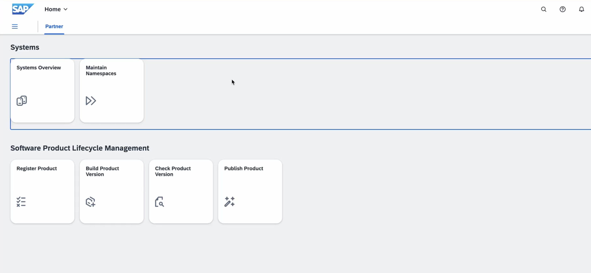
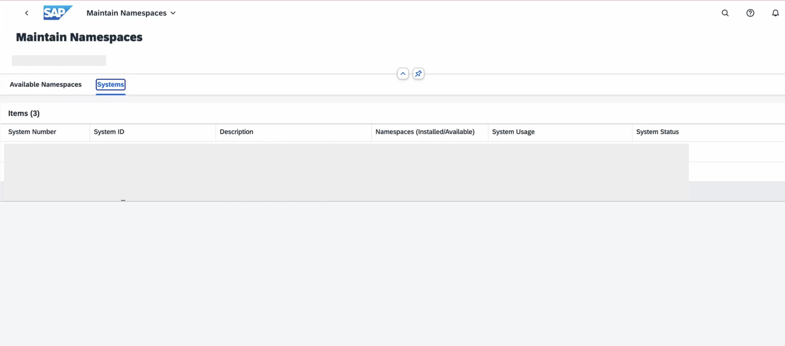
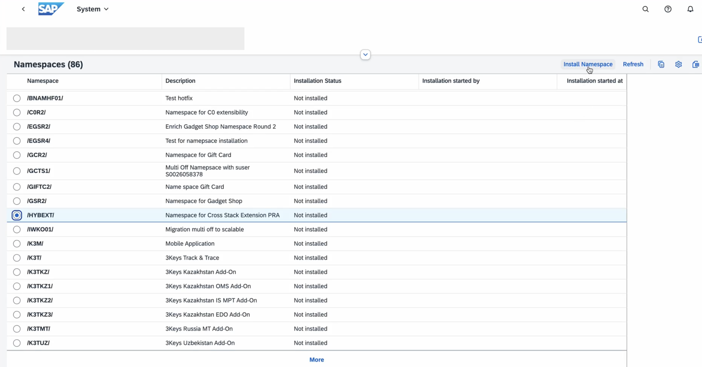
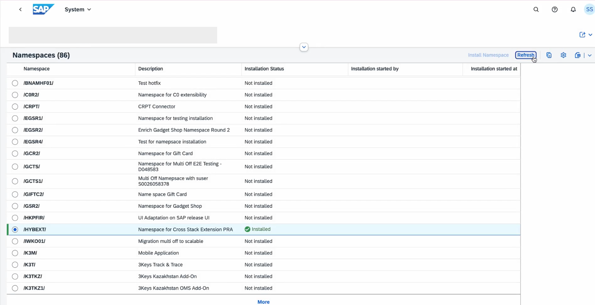
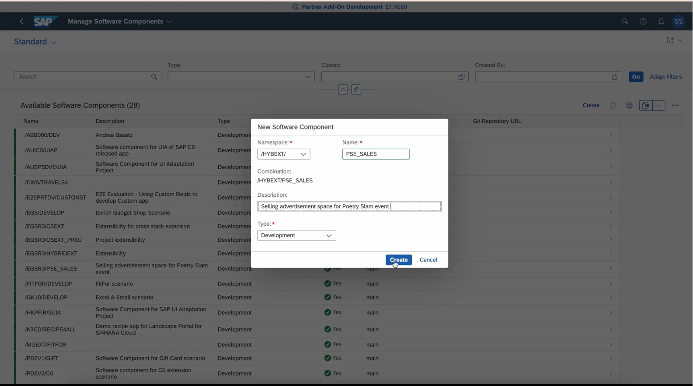
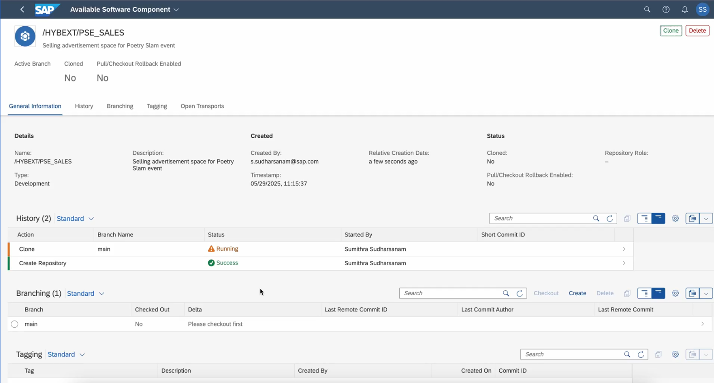
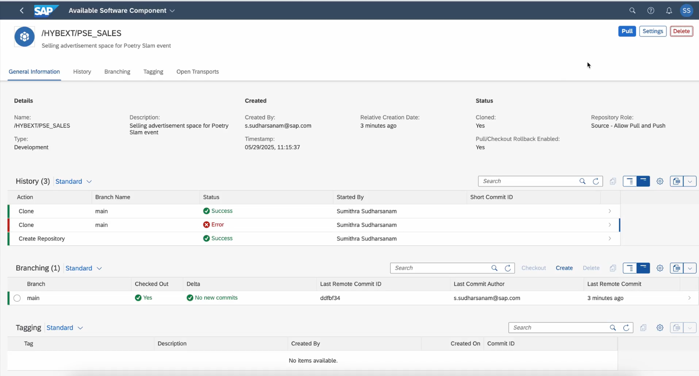

# Installing the Namespace in the Landscape Portal System

To install the namespace in the Landscape Portal system, follow these steps:

1. Log on to the Landscape Portal of your system.

2. Navigate to the **Maintain Namespaces** application.
   
   

3. Go to the **Systems** tab and select your dev system.
   
   

4. Select the **HYBEXT** namespace and choose **Install Namespace**. The status changes from **Not Installed** to **Installed** after some time.
   
   

5. Repeat the steps to install the namespace in your test system. Choose **Refresh** to see the updated status.
   
   

## Creating a Software Component in the HYBEXT Namespace

1. Open the **Manage Software Components** application and choose **Create**. Fill in the required details **Name**, **Description**, and **Type** and choose **Create**.
   > Note: You can set the **Type** to *Development*.
   
   

2. On the details page, choose **Clone**. In the pop-up, choose **Clone** again. In the **History** section, you can now see that the status for the clone is **Running**.
   
   

3. After some time, the status changes to **Success** and the **Clone** button changes to **Pull**.
   
   
