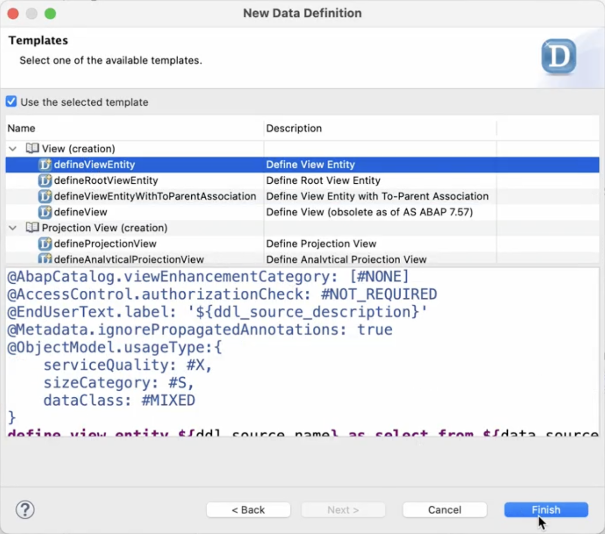

# Creating a Value Help CDS View

To create a value help CDS view, follow these steps.

1. In the Project Explorer, right-click the **ZPRA_PSE_SALES_ORDER** package and choose **New > Other ABAP Repository Object**.

2. Search for *Data Definition*, select it, and choose **Next**.

3. Enter the following data:

    - **Name**: `ZPRA_PSE_PS_ID_VH`

    - **Description**: `Poetry Slam ID Value Help`

4. Choose **Next**.

5. Select a transport request and choose **Finish**.

6. On the **Templates** screen, choose **Define View Entity** and then choose **Finish**.

    

7. Replace the generated code with the following ABAP code:

    ```ABAP
        @EndUserText.label: 'Value Help for Poetry Slam'
        @ObjectModel.dataCategory: #VALUE_HELP
        @Search.searchable: false
        @ObjectModel.query.implementedBy: 'ABAP:ZCL_PRA_PSE_VH'
        define custom entity ZPRA_PSE_PS_ID_VH
        {
        @UI.hidden:true
        key id                      : abap.char(255);
        
            @EndUserText.label: 'Number'
            zzpra_pse_ps_id_sdh : zpra_pse_ps_id;
            
            @EndUserText.label: 'Title'
            zzpra_pse_ps_title_sdh : zpra_pse_ps_title;
            
            @EndUserText.label: 'Status'
            zzpra_pse_ps_status_sdh : zpra_pse_ps_status;
            
        }
    ```

8. Save and activate your changes.
