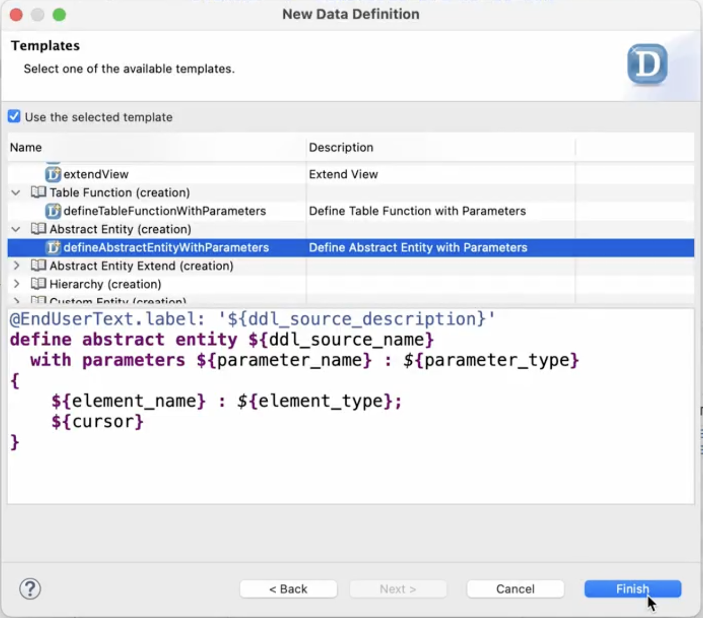

# Creating a CDS Abstract Entity for Assigning a Poetry Slam
    
1. In the Project Explorer, right-click on the **ZPRA_PSE_SALES_ORDER** package and choose **New > Other ABAP Repository Object**.

2. Search for **Data Definition**, select it, and choose **Next**.

3. Enter the following data:

    - **Name**: `ZPRA_PSE_ASSIGN_PSE_TO_SO`

    - **Description**: `Assigning Poetry Slam Event to Sales Order`
    
    Choose **Next**.

4. Select a transport request and choose **Finish**.

5. On the **Templates** screen, choose **Define Abstract Entity with Parameters** and choose **Finish**.

    

6. Replace the generated code with the following ABAP code:

    ```ABAP
        @EndUserText.label: 'Assigning Poetry Slam to Sales Order'
        @Search.searchable: false
        define abstract entity ZPRA_PSE_ASSIGN_PSE_TO_SO
        {
        @Consumption.valueHelpDefinition: [{
            entity     : {
            name     : 'ZPRA_PSE_PS_ID_VH',
            element  : 'zzpra_pse_ps_id_sdh'
            }
            }]
        @EndUserText.label: 'Poetry Slam Number'
        PoetrySlamId : zpra_pse_ps_id;
        }
    ```
7. Save and activate your changes.
