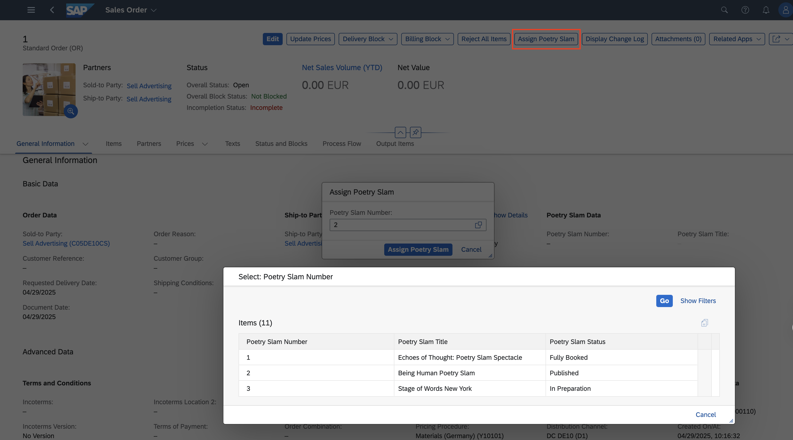
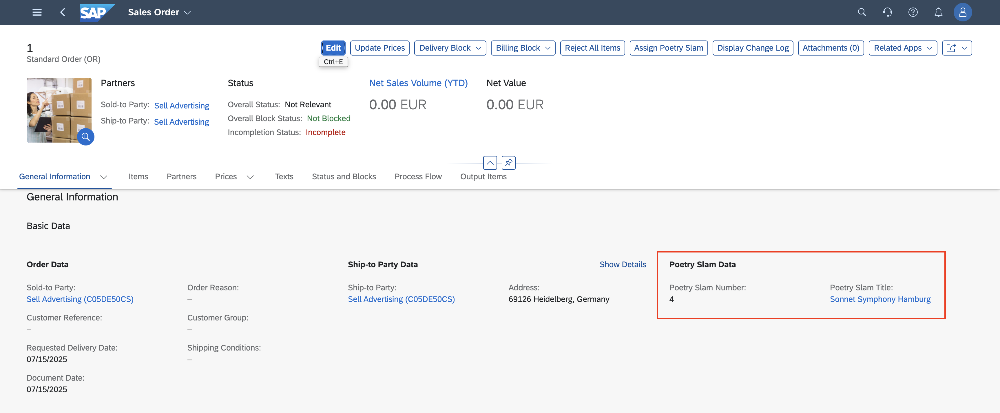
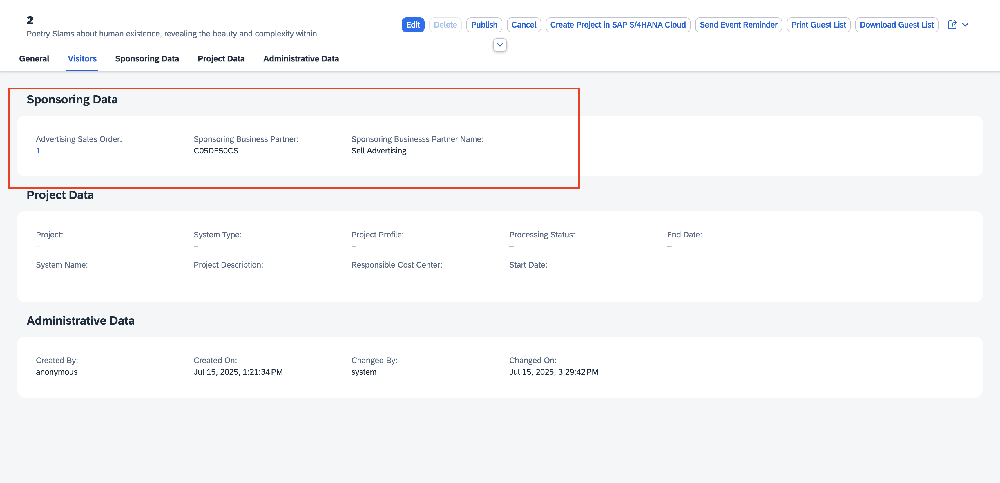

# **Review End-to-End Solution**

### Business Role

- To access and open sales orders, you must have one of the following roles assigned to your user:
  - `SAP_BR_INTERNAL_SALES_REP`
  - `SAP_BR_OPERATION_CLERK_ACM`
  - `SAP_BR_SETTLEMENT_CLERK_ACM`

- For more details, refer to the [Manage Sales Orders Fiori App (F3893)](https://fioriappslibrary.hana.ondemand.com/sap/fix/externalViewer/#/detail/Apps('F3893')/S30PCE).

### Steps to Assign Poetry Slam to Sales Order

1. Open the **Manage Sales Orders** application in the SAP S/4HANA Cloud Public Edition system.
2. If there are any sales orders available, you can open one and choose **Edit**. Alternatively, you can create a new sales order.
3. Once the sales order details are filled, choose **Save**.

  > Note: Make sure you save the sales order before assigning a poetry slam event. The **Assign Poetry Slam** action remains **disabled** until you save the sales order.

4. Choose **Assign Poetry Slam**. A popup with a **Poetry Slam Number** value help opens.

      

5. Select a poetry slam event from the value help and choose **Assign Poetry Slam**.
6. The **Poetry Slam Event** is assigned to the sales order. You can see both the **Poetry Slam Number** and the **Poetry Slam Title** in the **General Information** section of the sales order.

      

7. By choosing the assigned **Poetry Slam Title**, you can navigate to the assigned poetry slam event in the **Poetry Slam Manager** application.

8. In the **Poetry Slam Manager** application, in the **Sponsoring Data** section, the following details are displayed:
   - Advertising Sales Order
   - Sponsoring Business Partner
   - Sponsoring Business Partner Name

      

9. In the **Poetry Slam Manager** application, when you choose the assigned **Advertising Sales Order** in the **Sponsoring Data** section of a poetry slam event, you're redirected to the corresponding sales order instance in the **Manage Sales Orders** application.
