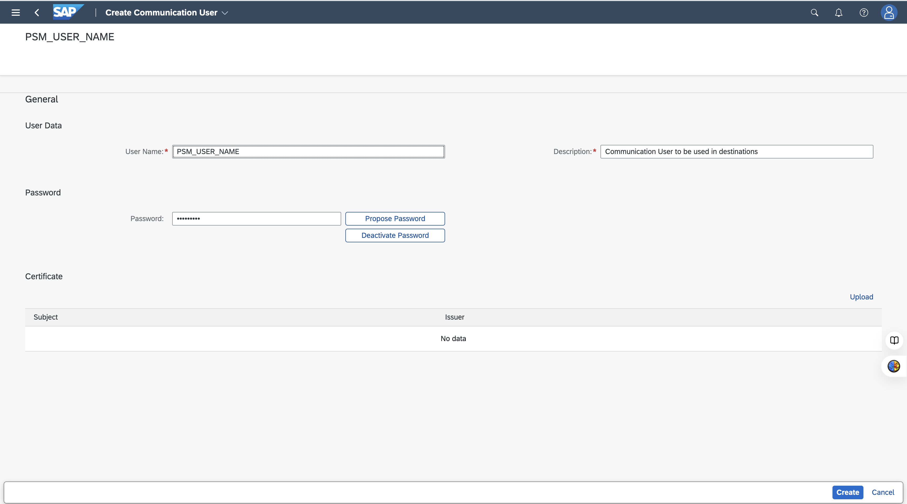

# Creating a Communication User

To create a communication user, follow these steps:

1. On SAP Fiori launchpad, open the **Maintain Communication Users** app.

2. Choose **New** and enter a **User Name**, **Description**, and **Password**. You can enter an own password or choose **Propose Password**.

 
    
3. Choose **Create**.

