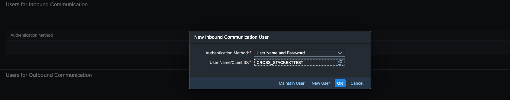

# Creating Communication Systems    

To create the necessary communication systems, follow these steps:

1. On SAP Fiori launchpad, open the **Communication Systems** app.

2. Choose **New**. Enter the following data and choose **Create**:

    - **System ID**: `ZPRA_PSE_S4HANA_TO_PS`

    - **System Name**: `ZPRA_PSE_S4HANA_TO_PS`

3. Under **Technical Data > General**, provide the following information:

    - **Host Name**: This is the service broker endpoint URL, You can find it in the **endpoints** section of credentials from the service broker instance in the subscribed subaccount. Remove *https://* from the host name.

    - **Logical System** : `BTP`
    - **Business System** : `BP_BTP`
    
    For more information on how to get the service broker endpoint URL, see the [consumption service section](./16-Integration.md#2-register-the-service-broker).
    
4. Under **Technical Data > OAuth 2.0 Settings**, provide the endpoints for the **Outbound OAuth 2.0 Client Settings**:

    - **Authorization Endpoint**: This is the authorization endpoint from the service broker instance of the Poetry Slam Manager application in the subscribed subaccount.

    - **Token Endpoint**: This is the token endpoint from the service broker instance of the Poetry Slam Manager application in the subscribed subaccount **/oauth/token**.

5. Under **Technical Data > Users for Outbound Communication**, choose the plus icon to add a new user.

    Provide the following details:

    - **Authentication Method**: OAuth 2.0

   -  **OAuth 2.0 Client ID**: This is the Client ID from the service broker instance of the Poetry Slam Manager application in the subscribed subaccount.

   -  **Client Authentication Type**: Basic

   -  **Client Secret**: This is the Client Secret from the service broker instance of the Poetry Slam Manager application in the subscribed subaccount.

6. Choose **Save**.

    
    
    

7. Create another communication system by repeating the steps. This will be used by the **ZPRA_PSE_SO_I_CA** and the **ZPRA_PSE_BP_CA** communication arrangements with the system ID and system name listed below. You also need to assign a communication user to this system.

    - **System ID**: `ZPRA_PSE_S4HANA_BP_TO_PS`

    - **System Name**: `ZPRA_PSE_S4HANA_BP_TO_PS`

    - Add a new communication user to the system in **Users for Inbound Communication**.

         
    - You don't need to assign a user in **Users for Outbound Communication**. 

8. Create another communication system with the following details:
    
    - **System ID**: `ZPRA_PSE_SO_URL`

    - **System Name**: `ZPRA_PSE_SO_URL`

9. Under **Technical Data > General**, provide the host name:

    - **Host Name**: This is the subscription application URL. You can find it in the subscribed application in the subscribed subaccount. Remove `https://` from the host name and the API endpoints after `.com`.

1ß. Choose **Save**.
