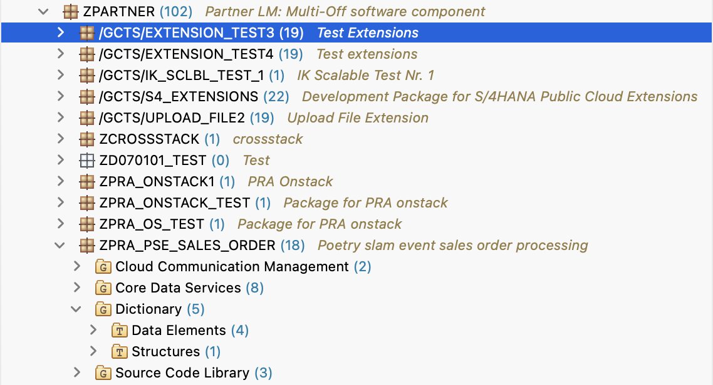

#  Creating a New ABAP Package for Sales Order Processing

To create a ABAP package in the Project Explorer, follow these steps:
    
1. In the Project Explorer, right-click on **Favorite Packages** and choose **Add Package**.

2. In the pop-up, enter *ZPARTNER* in the search and choose **OK**.

3. Once the **ZPARTNER** package is added to your favorite packages, right-click on the **ZPARTNER** package and select **New -> ABAP Package**.
4. Enter the following details and choose **Next**:
   - **Name**: `ZPRA_PSE_SALES_ORDER`
   - **Description**: `Poetry slam event sales order processing`

5. Leave the **Application Component** empty and choose **Next**.
6. Choose **Create a new request**. As transport request description, enter `Poetry slam event package creation`.
7. Choose **Finish**.
8. The **ZPRA_PSE_SALES_ORDER** ABAP package is now visible under the **ZPARTNER** package.

    
  
