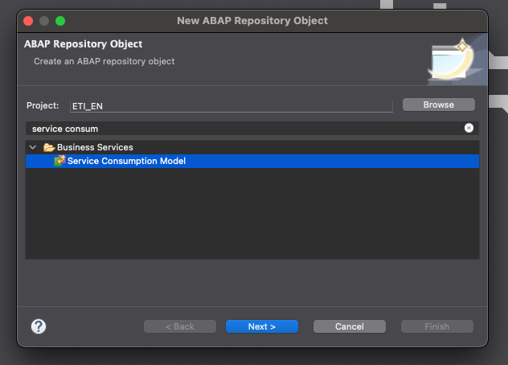
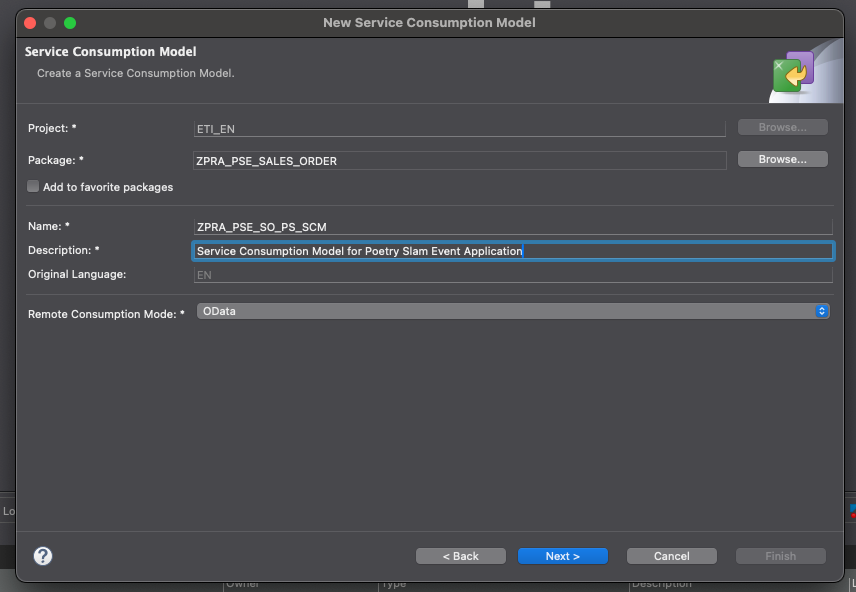
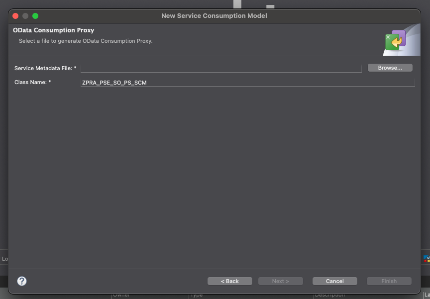
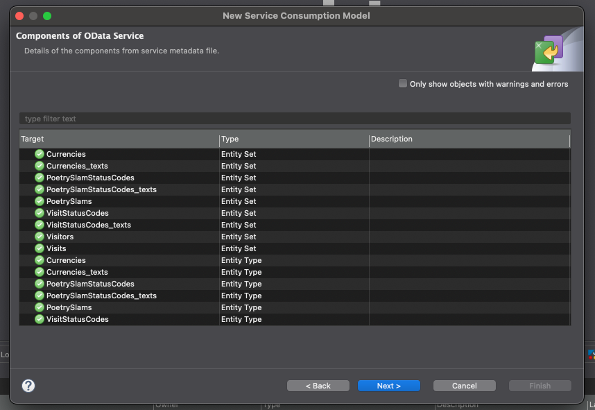
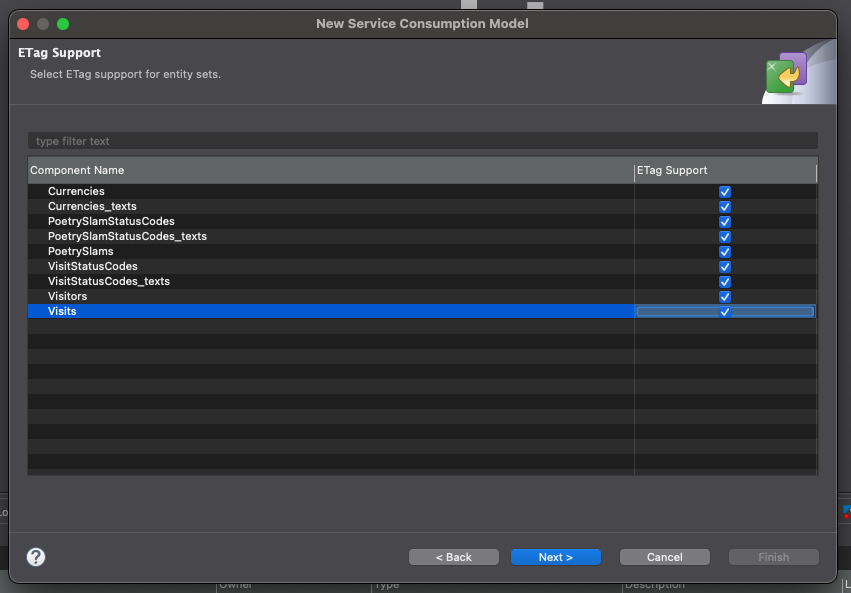
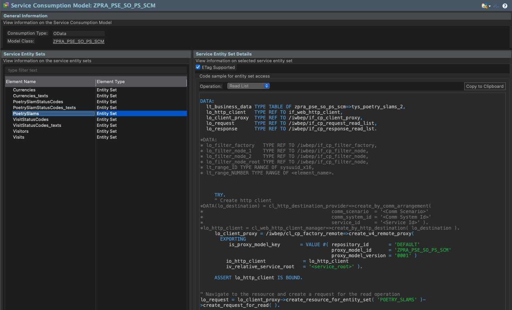
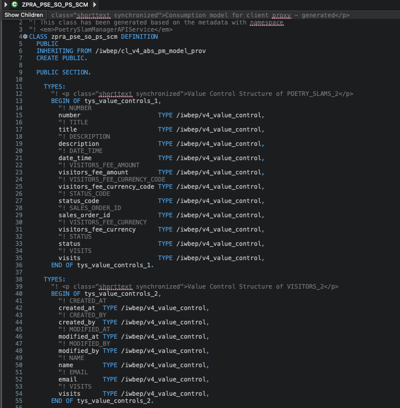

# Creating a Service Consumption Model (SCM) for the Poetry Slam Manager App

To create a Service Consumption Model (SCM) for making API calls from your on-stack extension to the **Poetry Slam Manager** app on SAP BTP, follow these steps:

1. Right-click the `ZPRA_PSE_SALES_ORDER` package and choose **New > Other ABAP Repository Object**.

2. Search for `Service Consumption Model`, select it and choose **Next**.

    

3. Enter the following data and choose **Next**:

    - **Name**: `ZPRA_PSE_SO_PS_SCM`

    - **Description**: `Service Consumption Model for Poetry Slam Event Application`

    - Select **Remote Consumption Model** : `OData`

    

4. Retrieve the metadata of the CAP service from the **Poetry Slam Manager** app. Save it in either `.xml` or `.edmx` format. You'll upload this file in the next step. You can refer to a sample metadata.edmx [here](./metadata.xml).

5. Upload the saved metadata file and choose **Next**.

    

6. The wizard shows all the components of the OData service that have been uploaded as metadata file. Check the components and choose **Next**.

    

7. Select the components for which ETag is required. For this on-stack extension scenario, we select all the components shown in the image below and choose **Next**:
   
    

8. Select a transport request and choose  **Finish**.

9. The SCM model and the class are generated with the following names:

    -   **Service Consumption Model** : `ZPRA_PSE_SO_PS_SCM`
    -   **Class** : `ZPRA_PSE_SO_PS_SCM`

    They look similar to the following images:
   
    

    

11. You initiate this proxy wherever you want to make an API call to the **Poetry Slam Manager** app from the on-stack extension. In this scenario, you call this proxy in the `ZPRA_PSE_R_SO_BEXT` behavior definition class and `ZCL_PRA_PSE_VH` value help class. These classes are implemented in the next step to extend the sales order.

12. In the SCM file, you can check the sample code to see how to instantiate the SCM class and make the necessary API calls to the **Poetry Slam Manager** app.

13. Make sure you have the necessary configurations for the API calls to work properly. This involves creating outbound services and setting up the communication scenario. You can find detailed instructions in the first two points of the [Communication Setup](../README.md#develop-the-extension-using-abap-development-tools-adt-in-the-development-system) section.

14. For more information on how to use the generated SCM class to make API calls, refer to [Service Consumption Model](https://help.sap.com/docs/SAP_S4HANA_CLOUD/6aa39f1ac05441e5a23f484f31e477e7/ed5d88ea66ce439398c37fe3dfc2cfd5.html?version=2408.500) on SAP Help Portal.
