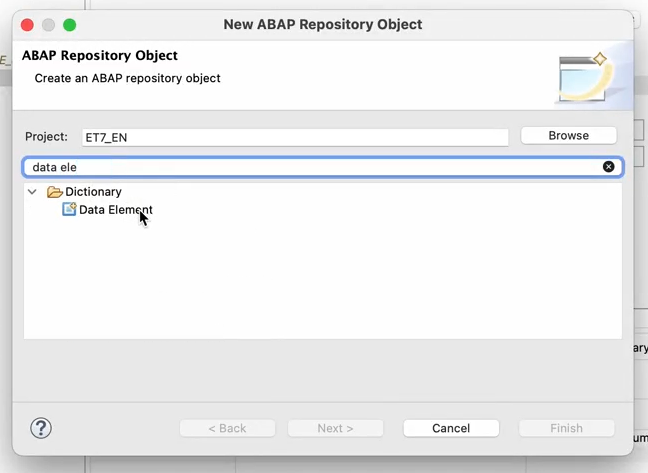

#  Creating Data Elements

To create data elements for the Poetry Slam Manager app, follow these steps:
    
1. Right-click on the **ZPRA_PSE_SALES_ORDER** package you've created in the Project Explorer under the **ZPARTNER** package and select **New -> Other ABAP Repository Objects**.

2. In the pop-up, enter **Data Element** in the search and select the data element in the **Dictionary** folder.

    

3. Enter the following details and choose **Next**:
    - **Name**: `ZPRA_PSE_PS_ID`
    - **Description**: `Poetry Slam Number`

4. Choose **Create a new request**. As transport request description, enter `Poetry slam objects` and choose **Finish**.

5. Select the generated data element and enter the following details:
    - **Category** : `Predefined Type`
    - **Data Type** : `CHAR`
    - **Length** : `255`
    - **Short** : `PS Number`
    - **Medium** : `Poetry Slam Number`
    - **Long** : `Poetry Slam Number`
    - **Heading** : `Poetry Slam Number`
    - Check the `Change Document Logging` and `Input History`.

    

7. **Activate** your changes.

8. Create the data elements listed below with the **Poetry slam objects** transport request and activate the changes for each data element.

    | Name | Description | Category, Type, and Length | Short | Medium/Long/Heading
    |:------------- |:--------------|:--------------|:--------------|:--------------|
    | `ZPRA_PSE_PS_TITLE`| Poetry Slam Title| Predefined : CHAR : 255 | PS Title | Poetry Slam Title
    | `ZPRA_PSE_PS_STATUS`| Poetry Slam Status| Predefined : CHAR : 255 | Status | Poetry Slam Status
    | `ZPRA_PSE_PS_URL`| Poetry Slam URL| Predefined : CHAR : 255 | URL | Poetry Slam URL

9. The image below shows the final structure of the package.

    
