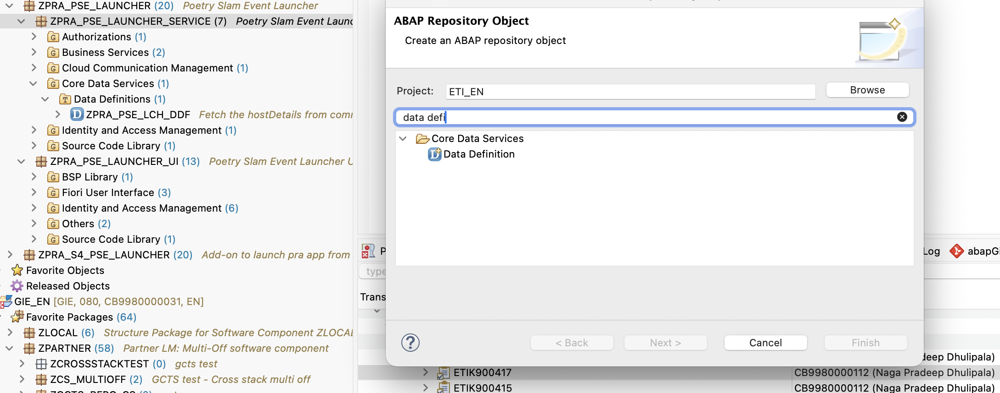

# Data Definition Creation

This tutorial describes how to create an unmanaged CDS Custom Entity in ABAP Development Tools (ADT).

**Steps in ADT (Define a CDS Custom Entity)**
1. In ADT, open your ABAP project and expand the target package.
2. Create a new repository object:
   - Right-click the package (**ZPRA_PSE_LAUNCHER_SERVICE**).
   - **New Repository Objects > Data Definition.**
     
   - **Click Next.**
3. Enter object details:
   - **Name:** **ZPRA_PSE_LCH_DDF**
   - **Description:** Custom Entity to fetch the hostDetails from communication system.
4. Replace the generated template with your custom entity definition. Example minimal template:
   ```
   @ObjectModel.query.implementedBy: 'ABAP:ZPRA_CL_PSE_COM_SYS'
   define custom entity ZPRA_PSE_LCH_DDF
   {
     key system_name : abap.char(500);
         host        : abap.char(500);
   }
   ```
   **Notes:**
   - This is an unmanaged CDS custom entity; data is provided by the ABAP class specified in @ObjectModel.query.implementedBy.
   - Implementing class ZPRA_CL_PSE_COM_SYS provides the query logic and returns the fields system_name and host with matching types.
   
5. **Save and activate:**
   - Press Ctrl+S (Cmd+S on macOS) to save.
   - Activate the object (Ctrl+F3 or right-click > Activate).

**Next steps**
- Proceed to [34 - LCH - Get Host Details](34-LCH-GetHostDetails.md) to implement the provider class and fetch communication system host details.
