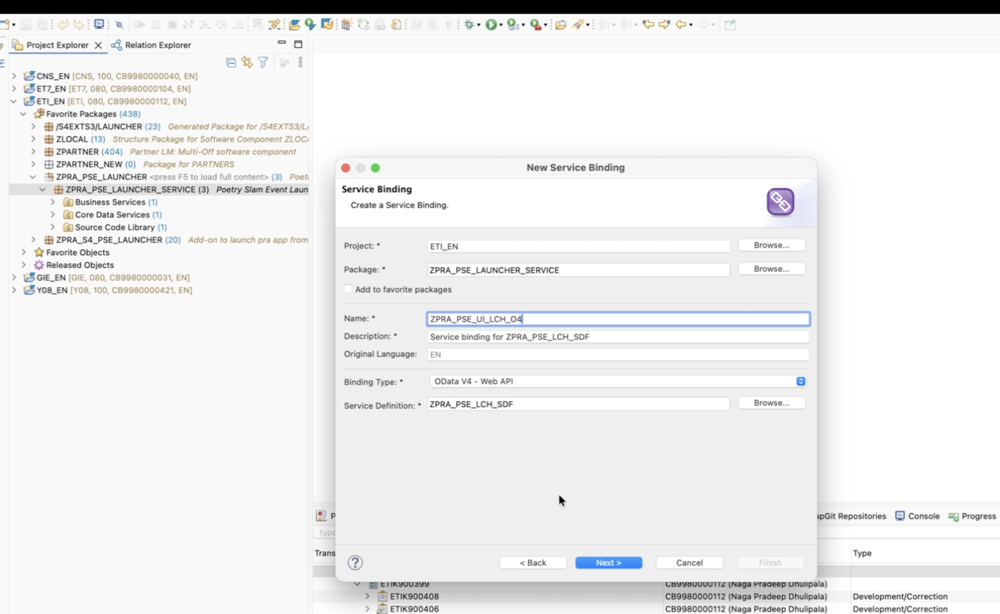

# Service Binding Creation

This tutorial provides the steps to create the OData V4 Service Binding **ZPRA_PSE_UI_LCH_O4** in ADT under the package **ZPRA_PSE_LAUNCHER_SERVICE** for the Service Definition **ZPRA_PSE_LCH_SDF**.

**Overview**
- Create an **OData V4 Service Binding** to make the service definition consumable by UI clients.
- Use the name **ZPRA_PSE_UI_LCH_O4** with description **Service binding for ZPRA_PSE_LCH_SDF**.
- Bind to the Service Definition **ZPRA_PSE_LCH_SDF** and preview the entity set **PSE_Launcher**.

**Prerequisites**
- The unmanaged CDS Custom Entity is active: [33 - LCH - Data Definition Creation](33-LCH-DataDefinitionCreation.md).
- The provider class is active: [34 - LCH - Get Host Details](34-LCH-GetHostDetails.md).
- The Service Definition is active: [35 - LCH - Service Definition Creation](35-LCH-ServiceDefinitionCreation.md).
- The target package exists: **ZPRA_PSE_LAUNCHER_SERVICE** (see [32 - LCH - Package Creation](32-LCH-PackageCreation.md)).

**Steps in ADT (Create OData V4 Service Binding)**
1. In ADT, open your ABAP project and expand the package **ZPRA_PSE_LAUNCHER_SERVICE**.
2. Create a new Service Binding:
   - Right-click the package.
   - Choose **New > Other…**
   - Navigate to **Core Data Services > Service Binding**.
   - Click **Next**.
3. Enter binding details:
   - **Name:** **ZPRA_PSE_UI_LCH_O4**
   - **Description:** Service binding for ZPRA_PSE_LCH_SDF
   - **Service Definition:** Select **ZPRA_PSE_LCH_SDF**
   - **Binding Type / Protocol:** **OData V4**
   - Click **Finish**.

   
4. Review and activate:
   - The binding will list the exposed entity set (alias) from the service: **PSE_Launcher**.
   - **Save and Activate** the service binding (Ctrl+F3 or right-click > Activate).

**Preview and validation**
- Open the Service Binding and choose **Preview** to start the local test service.
- In the preview, navigate to the entity set **PSE_Launcher** and perform a GET request.
- Verify the payload includes fields:
  - **system_name** (e.g., ZPRA_PSE_SO_URL)
  - **host** (hostname of the configured communication system)

**Notes**
- The alias defined in the service definition (**PSE_Launcher**) becomes the entity set name in the OData V4 service.

**Next steps**
- Proceed to [37 - LCH - Destinations for Fiori Deployment](37-LCH-DestinationsForFioriDeployment.md) to configure BTP subaccount destinations required for deploying the UI application from BAS to the S/4 system.