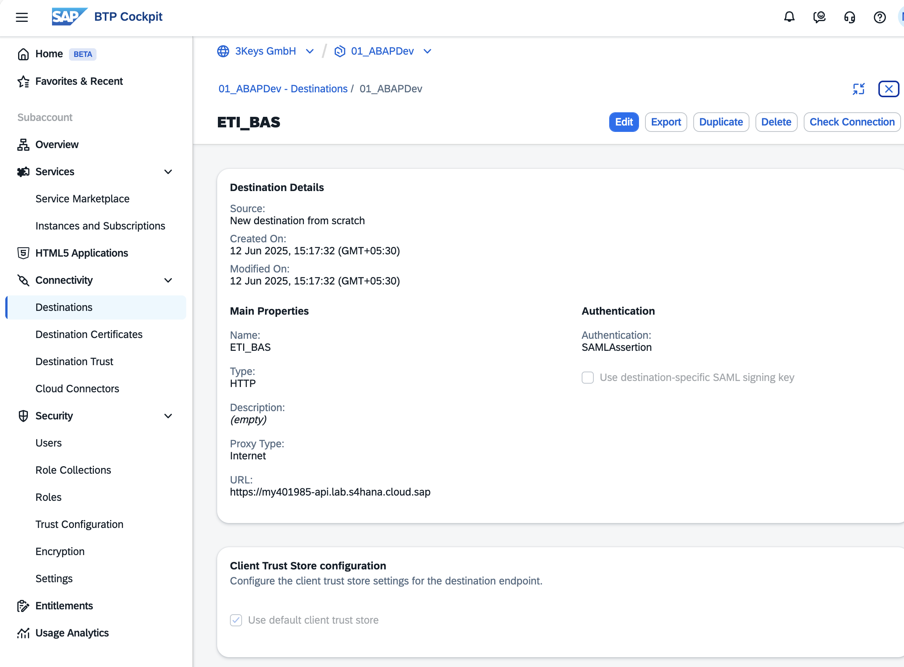

# Subaccount Destinations for Fiori Deployment (BTP → S/4HANA)

This tutorial clarifies the requirement for having a BTP Subaccount **Destination** so that **SAP Business Application Studio (BAS)** can discover services and deploy your Fiori app to the **SAPUI5 ABAP Repository** in the **S/4HANA** system.

Overview
- Ensure that in the BTP subaccount where **BAS** is subscribed, an HTTP **Destination** to your S/4HANA backend exists.
- This destination is used by:
  - The BAS generator’s “**Connect to system**” flow (service discovery, e.g., **OData V4**)
  - “**Deploy to SAPUI5 ABAP Repository**” during UI deployment

Screenshot (example destination in BTP Cockpit)
- Example Destination: **ETI_BAS**
  - 
- Visible properties in the screenshot (for guidance):
  - **Name:** ETI_BAS
  - **Type:** HTTP
  - **Proxy Type:** Internet
  - **Authentication:** SAMLAssertion (principal propagation)
  - **URL:** https://hostId-api.lab.s4hana.cloud.sap
  - **Client Trust Store:** Use default client trust store

Prerequisites
- **BAS** is subscribed to the BTP subaccount where the **Destination** is configured.
- S/4HANA system base **URL** is known (e.g., https://your-s4.example.com, client 100).
- ABAP UI package exists: **ZPRA_PSE_LAUNCHER_UI** ([32 - LCH - Package Creation](32-LCH-PackageCreation.md)).

Next steps
- Proceed to [38 - LCH - BAS Fiori App Creation (Freestyle)](38-LCH-BASFioriAppCreation.md) to generate the app using **Connect to system**.
