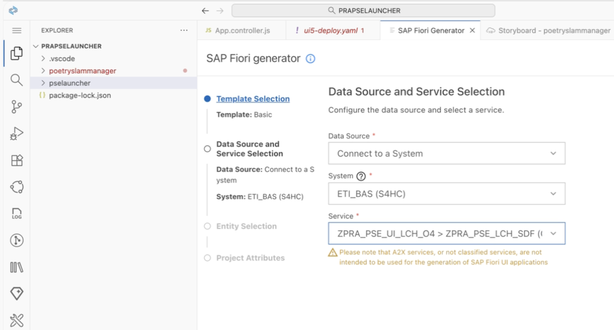
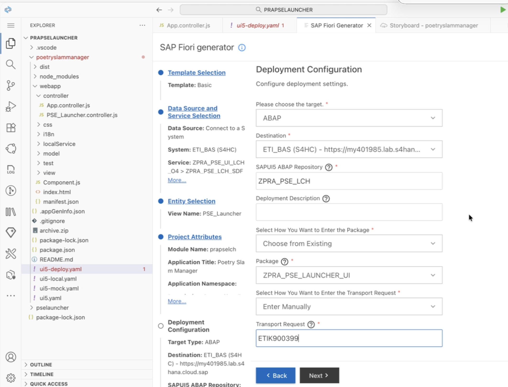

# BAS Fiori App Creation (Freestyle)

This tutorial describes how to create a freestyle SAPUI5 (Fiori) application in **SAP Business Application Studio (BAS)** using the **Fiori Tools – Application Generator**. The app will consume the OData V4 Service Binding created previously and use the data source option **Connect to system**.

**Reference tutorial** (generator flow, preview, deploy): https://developers.sap.com/tutorials/abap-environment-deploy-fiori-elements-ui.html#a536f120-ced8-476c-b07a-4f0ef89d9c26  

**Overview**
- Create a freestyle Fiori app named **ZPRA_PSE_LCH_SDF** with title/description **Service Definition to expose custom entity**.
- Connect the app to your ABAP system via destination and consume the service definition **ZPRA_PSE_LCH_SDF** bound through **ZPRA_PSE_UI_LCH_O4** (OData V4).
- Generate a working UI you can preview in BAS and later deploy to the ABAP backend.

**Prerequisites**
- OData V4 Service Binding is active: [36 - LCH - Service Binding Creation](36-LCH-ServiceBindingCreation.md)  
  - Service Definition: **ZPRA_PSE_LCH_SDF**  
  - Service Binding: **ZPRA_PSE_UI_LCH_O4**  
  - Exposed entity set alias: **PSE_Launcher**
- BAS Dev Space with **SAP Fiori** extension is running.
- Destination to your ABAP system configured in BTP subaccount: [37 - LCH - Destinations for Fiori Deployment](37-LCH-DestinationsForFioriDeployment.md).  
  - The destination must allow BAS to reach the ABAP system and discover OData services.
- Packages exist in ABAP for organizing UI content: [32 - LCH - Package Creation](32-LCH-PackageCreation.md).

**Steps in BAS (Create a Freestyle Fiori app)**
1. Start BAS Dev Space
   - Open SAP Business Application Studio and start your **SAP Fiori** dev space.
   - From the BAS welcome page or Command Palette, choose **Start from template** or run the command: **Fiori: Open Application Generator**.

2. **Template selection**
   - In the generator, choose **SAPUI5 freestyle**.
   - Select **SAPUI5 Application** (freestyle application type).
   - Click **Next**.

3. **Data source: Connect to system**
   - For the data source option, choose **Connect to system**.
   - Select your ABAP destination configured in BTP .
   - Choose **OData V4** as the protocol/version.
   - In the service selection:
     - Service Definition: pick **ZPRA_PSE_LCH_SDF**.
     - Service Binding: **ZPRA_PSE_UI_LCH_O4** (if prompted).
     - Confirm the entity set alias **PSE_Launcher** is discoverable.
   - Proceed to the next step.

   

4. **Application attributes**
   - **Application Name:** ZPRA_PSE_LCH_SDF
   - **Application Title:** Service Definition to expose custom entity
   - **Namespace:** e.g., zpra.pse.launcher (or a namespace consistent with your standards)
   - Optional FLP configuration (recommended for later Launchpad integration):
     - **Semantic Object:** ZPRA_PSE_LAUNCHER
     - **Action:** display
     - **App Description:** Service Definition to expose custom entity
   - Click **Next**.

5. **View/controller setup (freestyle)**
   - Choose initial view name (e.g., **PSE_Launcher**).
   - Let the generator scaffold a basic freestyle view and controller.
   - The generator will add the OData V4 dataSource and model entries to the **manifest.json** based on the selected system/service.

6. **Deployment configuration (in generator)**
   - In the generator, enable **Deployment configuration**.
   - **Deployment target:** SAPUI5 ABAP Repository.
   - **Destination:** Select your ABAP destination (same used for “Connect to system”).
   - **BSP Application name:** ZPRA_PSE_LCH_SDF (or use your UI package naming convention).
   - **ABAP Package:** ZPRA_PSE_LAUNCHER_UI.
   - **Transport request:** Select/create as required.
   - The generator will add deploy tasks and configuration so you can deploy directly from BAS.

   

7. **Fiori Launchpad configuration (in generator)**
   - Enable **Fiori Launchpad configuration**.
   - **App Title:** Poetry Slam Manager
   - **Subtitle:** (optional) Host details from communication system
   - **Semantic Object:** PoetrySlamManager
   - **Action:** display
   - This creates the FLP intent (ZPRA_PSE_LAUNCHER-display) and adds the necessary configuration to the app’s manifest.

8. **Finish generation**
   - Click **Finish** to create the project.
   - BAS will scaffold the project with a ready-to-run configuration, including local preview tasks.

**Controller logic: Open side-by-side app in a new window (App.controller.js)**
Add the following controller logic to open the target application in a separate browser tab based on the host returned by your OData V4 service. Place this code in your UI5 controller file (at: webapp/controller/App.controller.js).

Description
- On initialization (onInit), the controller:
  - Reads the OData V4 service URL from manifest.json (sap.app.dataSources.mainService.uri).
  - Creates an ODataModel and fetches the first record from the exposed entity set alias PSE_Launcher.
  - If a host is returned, opens https://<host> in a new tab and then navigates back to the Launchpad using window.history.go(-1).
  - Logs warnings or errors if data is missing or if an exception occurs.

Code
```javascript
sap.ui.define([
"sap/ui/core/mvc/Controller",
"sap/ui/model/odata/v4/ODataModel",
"sap/base/Log"
], (BaseController, ODataModel, Log) => {
"use strict";

return BaseController.extend("prapselch.controller.App", {
    onInit() {
    try {
        // Retrieve the service URL from manifest.json
        var sServiceUrl = this.getOwnerComponent().getManifestEntry("sap.app").dataSources.mainService.uri;
        var oModel = new ODataModel({ serviceUrl: sServiceUrl });

        if (!sServiceUrl) {
        throw new Error("Service URL is missing in manifest.json");
        }

        // Define the entity set path
        var sPath = "/PSE_Launcher"; // Entity name

        // Fetch data without binding the model to the view
        oModel.bindList(sPath).requestContexts(0, 1)
        .then(aContexts => {
            if (aContexts.length === 0) {
            Log.warning("No data found in OData service");
            return null;
            }
            return aContexts[0].requestObject();
        })
        .then(oData => {
            if (oData && oData.host) {
            window.open("https://" + oData.host, "_blank");
            if (window.history && window.history.go) {
                window.history.go(-1); // Go back to previous page (Launchpad)
            }
            } else {
            Log.warning("Host field is missing in the response");
            }
        })
        .catch(oError => {
            Log.error("Error fetching OData data:", oError);
        });
    } catch (oError) {
        Log.error("Initialization error:", oError);
    }
    }
});
});
```

**Run and preview**
- In BAS, open the **Run Configurations** view or run **Fiori: Open Application Preview** from the Command Palette (View > Command Palette… or Cmd/Ctrl+Shift+P).
  - The preview picker opens and lists available run configurations for your project.
  - Select the generated configuration for your app.
  - BAS starts a local preview server and opens the app in a new browser tab.
  - If the preview fails to load data, verify the destination and service binding as noted above.

**Next steps**
- Proceed to [39 - LCH - UI Deployment from BAS to S/4 System](39-LCH-UIDeploymentFromBAS.md) to deploy the app to the ABAP repository and verify artifacts in ADT.

  