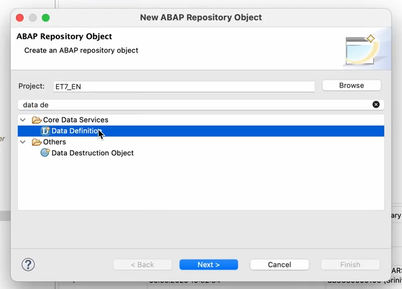
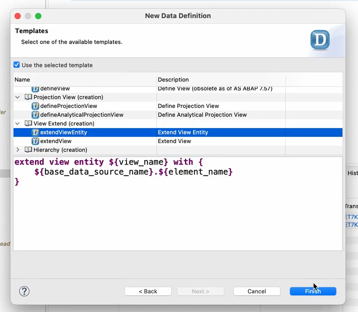
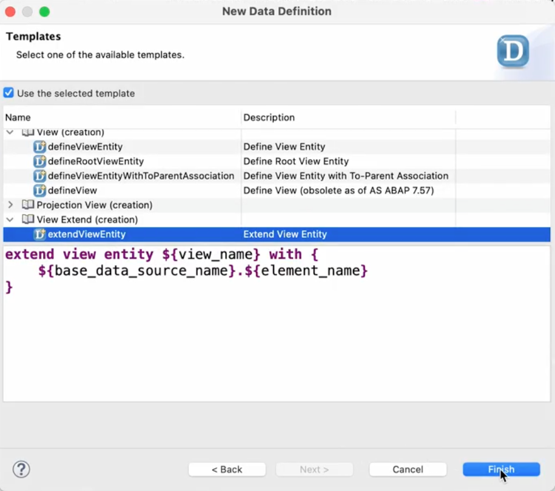

# Creating Data Definitions for E_SALESDOCUMENTBASIC, R_SALESORDERTP, and I_SALESORDERTP

To create data definitions for **E_SALESDOCUMENTBASIC**, **R_SALESORDERTP**, and **I_SALESORDERTP**, follow these steps:

---

## 1. Create Data Definition for E_SALESDOCUMENTBASIC

1. In Project Explorer, under the **ZPARTNER** package, right-click on **ZPRA_PSE_SALES_ORDER** and select  
   **New → Other ABAP Repository Objects**.

2. In the pop-up, enter `Data Definition` in the search and select the data element in the **Core Data Services** folder.

   <p align="center">
       
   </p>

3. Enter the following details and choose **Next**:
   - **Package**: `ZPRA_PSE_SALES_ORDER`
   - **Name**: `ZPRA_PSE_E_SO_EXT`
   - **Description**: `Extension of E_SALESDOCUMENTBASIC for PSE`
   - **Referenced Object**: `E_SALESDOCUMENTBASIC`

4. Select the **Poetry slam objects** transport request and choose **Next**.

5. In the **View Extend** section, select the **extendViewEntity** template and choose **Finish**.

   <p align="center">
       
   </p>

6. In the generated extend view entity file, add the following snippet:

   ```abap
   Persistence.zzpra_pse_ps_id_sdh as zzpra_pse_ps_id_sdh,
   Persistence.zzpra_pse_ps_title_sdh as zzpra_pse_ps_title_sdh,
   Persistence.zzpra_pse_ps_url_sdh as zzpra_pse_ps_url_sdh
   ```

   <p align="center">
       
   </p>

7. **Activate** your changes.

---

## 2. Create Data Definition for R_SALESORDERTP

1. Repeat steps 1–2 above.

2. Enter the following details and choose **Next**:
   - **Package**: `ZPRA_PSE_SALES_ORDER`
   - **Name**: `ZPRA_PSE_R_SO_EXT`
   - **Description**: `Extension of R_SalesOrderTP for PSE`
   - **Referenced Object**: `R_SALESORDERTP`

3. Select the **Poetry slam objects** transport request and choose **Next**.

4. In the **View Extend** section, select the **extendViewEntity** template and choose **Finish**.

   <p align="center">
       
   </p>

5. In the generated extend view entity file, add the following snippet:

   ```abap
   _Extension.zzpra_pse_ps_id_sdh as zzpra_pse_ps_id_sdh, 
   _Extension.zzpra_pse_ps_title_sdh as zzpra_pse_ps_title_sdh,
   _Extension.zzpra_pse_ps_url_sdh as zzpra_pse_ps_url_sdh
   ```

   <p align="center">
       
   </p>

6. **Activate** your changes.

---

## 3. Create Data Definition for I_SALESORDERTP

1. Repeat steps 1–2 above.

2. Enter the following details and choose **Next**:
   - **Package**: `ZPRA_PSE_SALES_ORDER`
   - **Name**: `ZPRA_PSE_I_SO_EXT`
   - **Description**: `Extension of I_SalesOrderTP for PSE`
   - **Referenced Object**: `I_SALESORDERTP`
   - **Transport Request**: `Poetry slam objects`
   - **Template**: `extendViewEntity` in **View Extend (creation)**

3. In the generated extend view entity file, add the following snippet:

   ```abap
   SalesOrder.zzpra_pse_ps_id_sdh as zzpra_pse_ps_id_sdh, 
   SalesOrder.zzpra_pse_ps_title_sdh as zzpra_pse_ps_title_sdh,
   SalesOrder.zzpra_pse_ps_url_sdh as zzpra_pse_ps_url_sdh
   ```

   <p align="center">
       
   </p>

4. **Activate** your changes.

---
