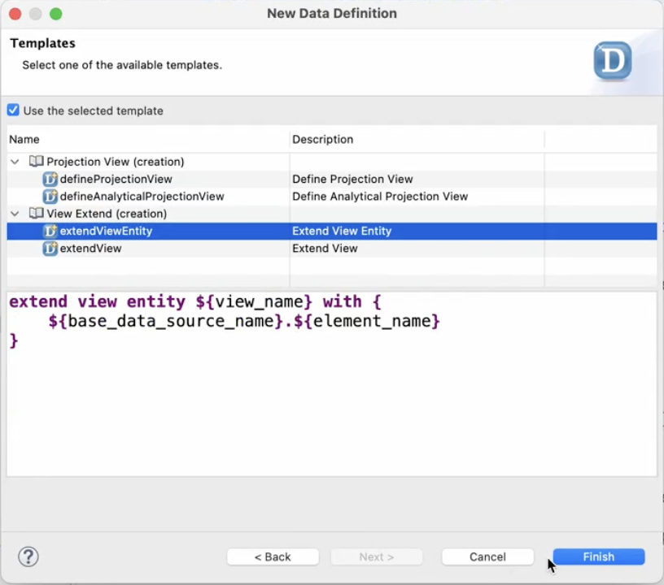

# Extending the Projection View C_SalesOrderManage to Include the Fields for the Poetry Slam ID and Poetry Slam Title

To extend the **C_SalesOrderManage** projection view, follow these steps:

1. In the Project Explorer, right-click the **ZPRA_PSE_SALES_ORDER** package and choose **New > Other ABAP Repository Object**.

2. Search for **Data Definition**, select it, and choose **Next**.

3. Enter the following data:

    - **Name**: `ZPRA_PSE_C_SOMANAGE_EXT`

    - **Description**: `Sales Order Projection View Extension for PSE`

    - **Referenced Object**: `C_SalesOrderManage`

4. Choose **Next**.

5. Select a transport request and choose **Finish**.

6. On the **Templates** screen, choose **Extend View Entity** and choose **Finish**.

    

7. Replace the generated code with the following ABAP code:

    ```ABAP
        extend view C_SalesOrderManage with ZPRA_PSE_C_SOMANAGE_EXT
        {
        @UI: {
        identification:[{ importance: #HIGH, type: #FOR_ACTION, dataAction: 'zzpra_pse_assign_ps', label: 'Assign Poetry Slam' }]}
        @UI.facet: [
            {
                id:         'PoetrySlamData',
                label:      'Poetry Slam Data',
                purpose:    #STANDARD,
                type:       #FIELDGROUP_REFERENCE,
                parentId:   'BasicData',
                importance: #HIGH,
                position:   30,
                targetQualifier: 'PoetrySlamData'
            }
            ]


        @UI.fieldGroup: [ { qualifier: 'PoetrySlamData',position: 10, hidden:false,  importance: #HIGH ,type: #WITH_URL, url:'zzpra_pse_ps_url_sdh' } ]


        SalesOrder.zzpra_pse_ps_id_sdh    as zzpra_pse_ps_id_sdh,

        @UI.fieldGroup: [ { qualifier: 'PoetrySlamData',
                            position: 20,
                            hidden:false,
                            importance: #HIGH } ]


        SalesOrder.zzpra_pse_ps_title_sdh as zzpra_pse_ps_title_sdh,

        SalesOrder.zzpra_pse_ps_url_sdh as zzpra_pse_ps_url_sdh
            
        }

    ```
8. Save and activate your changes.
